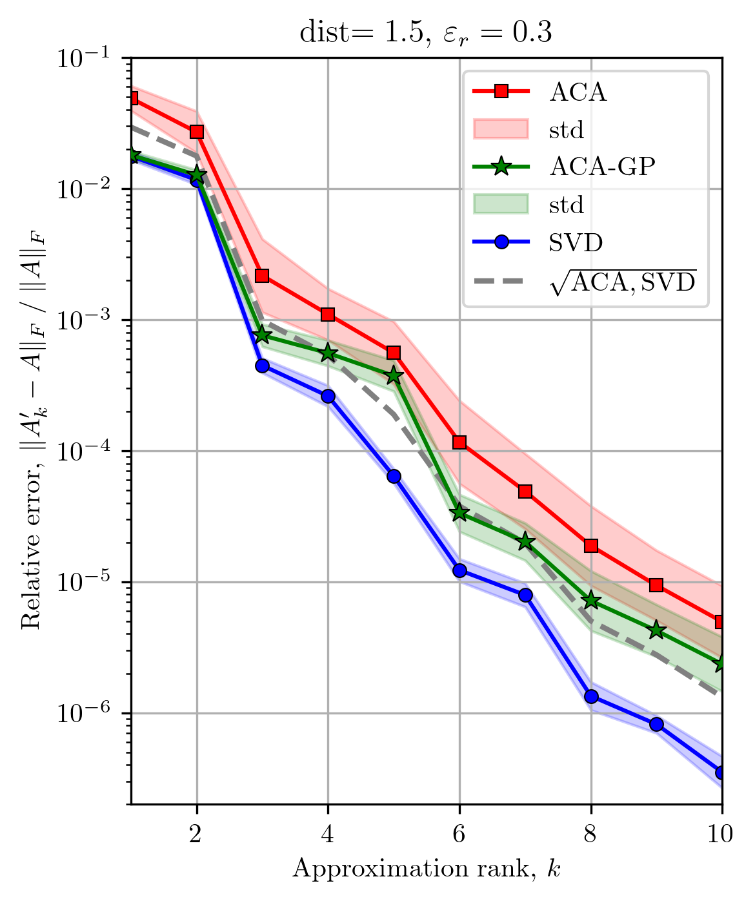
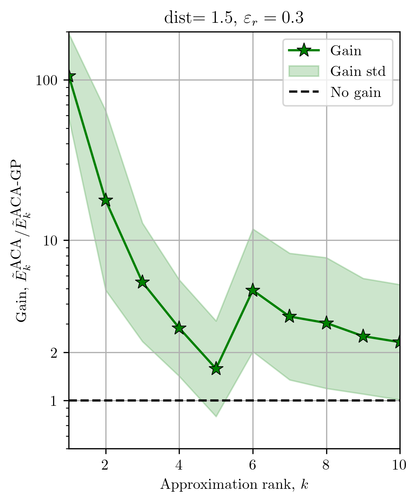

# Adaptive Cross Approximation: ACA and ACA-GP

This repository contains the implementation of the Adaptive Cross Approximation (ACA) and the Adaptive Cross Approximation with Geometrical Pivot selection (ACA-GP) algorithms. The ACA algorithm is a low-rank matrix approximation algorithm that is particularly well-suited for matrices that arise in the context of integral equations. The ACA-GP algorithm is a variant of the ACA algorithm that is designed to enhance the purely algebraic ACA algorithm by incorporating a geometrical pivot selection strategy. The ACA-GP algorithm can be marginally more computationally costly but constantly outperforms the classical ACA both in average accuracy and in the accuracy dispersion.

**License:** BSD 3-Clause

**Language:** Python

## Performance

For two separate randomly oriented clouds of points the ACA-GP algorithm is on average 2-3 times more accurate than the classical ACA algorithm.

 


## Usage

Clone the repository 
```bash
git clone git@github.com:vyastreb/ACA.git
```

Install the requirements
```bash
pip install -r requirements.txt
```
If you cannot install requirements in the reference folder, you can install them in your own folder:
```bash
pip install -r requirements.txt -target /path/to/your/folder
```
and define the path to the folder in the `PYTHONPATH` environment variable:
```bash
export PYTHONPATH=/path/to/your/folder:$PYTHONPATH
```

Usage of the ACA algorithm (see `test.py`)

```python
import numpy as np
import time
import ACAs as aca

# Parameters
algorithm = "ACA-GP"  # "ACA" or "ACA-GP"
seed = 128
np.random.seed(seed)

# Number of points
N = 1000
M = 1500

# Low-rank approximation parameters
tolerance = 1e-3
min_pivot = 1e-12
max_rank = min(min(N, M), 15)
Green_kernel_power = 1
Green_kernel_factor = 1
# ACA-GP specific parameters
central_fraction = 0.1
square_shape = True # If True, the shape of the target and source clouds should be square-like, if False, the clouds can have arbitrary shape.

# Create clouds of points
x_coord = np.random.rand(N, 2) + np.array([1.5, 0.5])
y_coord = np.random.rand(M, 2)

# Run ACA algorithm
start_time = time.time()
if algorithm == "ACA":
    U, V, error, rank, _, _, _ = \
        aca.aca(x_coord, y_coord, tolerance, max_rank, min_pivot, Green_kernel_factor, Green_kernel_power)
elif algorithm == "ACA-GP":
    U, V, error, rank, _, _, _, _, _ = \
        aca.aca_gp(x_coord, y_coord, tolerance, max_rank, min_pivot, Green_kernel_factor, Green_kernel_power,
                    central_fraction, square_shape)
else:
    raise ValueError("Invalid algorithm")
end_time = time.time()

# Compute approximation and error
approx_matrix = np.dot(U, V)
full_matrix = np.array([aca.line_kernel(x, y_coord, Green_kernel_factor, Green_kernel_power) for x in x_coord])
norm_full_matrix = np.linalg.norm(full_matrix, "fro")
aca_error = np.linalg.norm(approx_matrix - full_matrix, "fro") / norm_full_matrix

# Print results
print(f"/ Algorithm: {algorithm} for {N} x {M} clouds")
print(f" Time (s):              {end_time - start_time:<10.4f}")
print(f" Approximation rank:    {rank+1:<10d}")
print(f" Storage fraction (%):  {(rank+1)*(N+M)/(N*M)*100:<10.2f}")
print(f" Requested tolerance:   {tolerance:<10.2e}")
print(f" Approximate error:     {error:<10.2e}")
print(f" True relative error:   {aca_error:<10.2e}")

```

## Other scripts

Apart from the ACA library, the repository contains a few other helpful scripts.

+ An extended version of the test is available in `extended_test.py`.
+ Script `test_for_point_clouds.py` contains an elaborated test of the ACA and ACA-GP algorithms for two rectangular clouds of a given aspect ratio and rotated one with respect to another by a random angle. The user can define the target distance between these clouds and define the type of points' distribution (uniform or normal). The script computes ACA and ACA-GP low-rank approximations and computes an SVD for comparison.
+ Script `Genetic_Search_For_best_skeleton.py` uses library `ACA_genetic.py` to generate the best skeleton for the given interaction matrix: this is computationally expensive because it explores all possible skeletons.

## References

Vladislav A. Yastrebov. ACA-GP: Adaptive Cross Approximation with a Geometrical Pivot Choice. arXiv preprint [arXiv:??.??](https://arxiv.org/abs/??.??), 2024.


